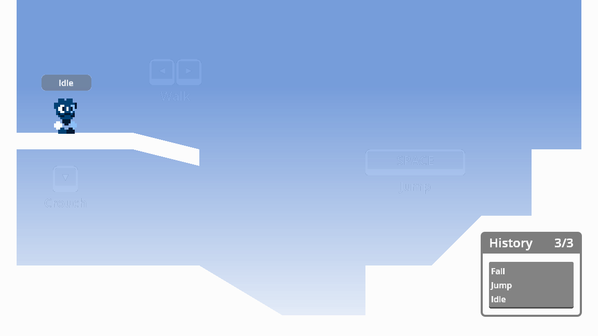

#  StateMachine Nodes

A set of Finite State Machine nodes used to manage and process logic.

> [!NOTE]
> Once the add-on is enabled, its documentation can be accessed directly from the Godot IDE (``F1``).
